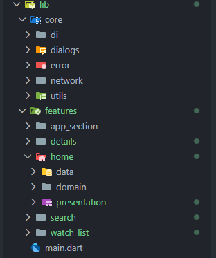
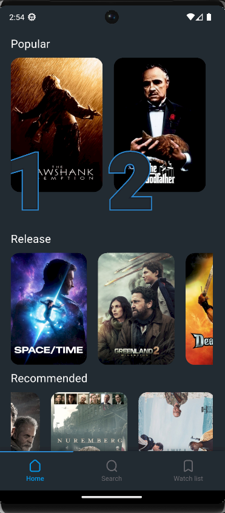
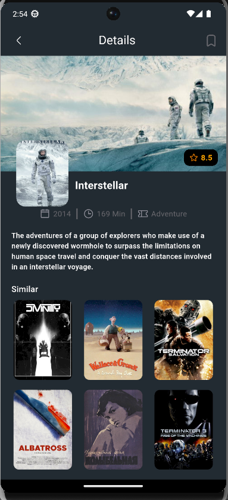
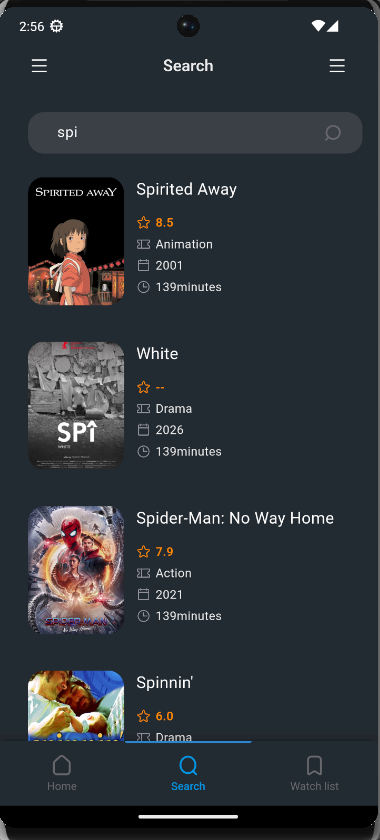
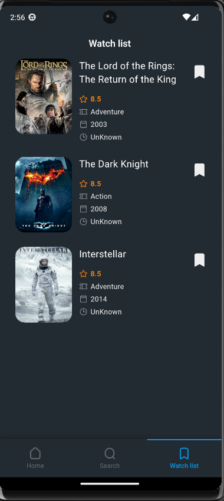

# 🎬 MOVIE APP

A Flutter Movie application built using **Clean Architecture + MVI pattern**, powered by TMDB API.

---

## 🚀 Getting Started

- Clean Architecture (Data – Domain – Presentation).
- MVI Architecture Pattern.
- State Management using Cubit (flutter_bloc).
- Fully API dependent (TMDB).
- Dependency Injection using GetIt.
- Error Handling (Network & Server).
- Loading & Shimmer States.
- Modular feature-based structure.
- Scalable & Maintainable codebase.

---

## 🤳 Screens

- **Home Screen:** Display popular and upcoming movies.
- **Search Screen:** Search for movies with real-time results.
- **Details Screen:** Show movie details, overview, rating, and recommendations.
- **Watch List Screen:** Show movie that you save it 

---

## 📁 Files Structure

---

## 🏗 Architecture

The project follows:

- **MVI (Model – View – Intent)**
- **Clean Architecture**
- **Unidirectional Data Flow**

### 🔁 Data Flow

User Action → Cubit (Intent) → UseCase → Repository → DataSource → API  
API Response → Repository → UseCase → New State → UI Rebuild

---

## 📸 UI

- Contributions are welcome 💜
- If you encounter any issues or have suggestions for improvements, please open an issue or submit a pull request.
